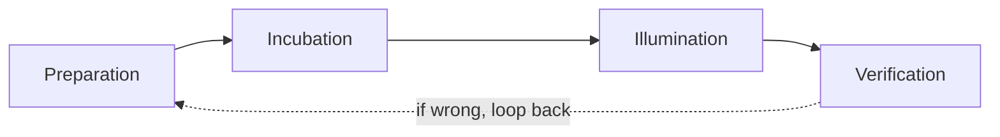
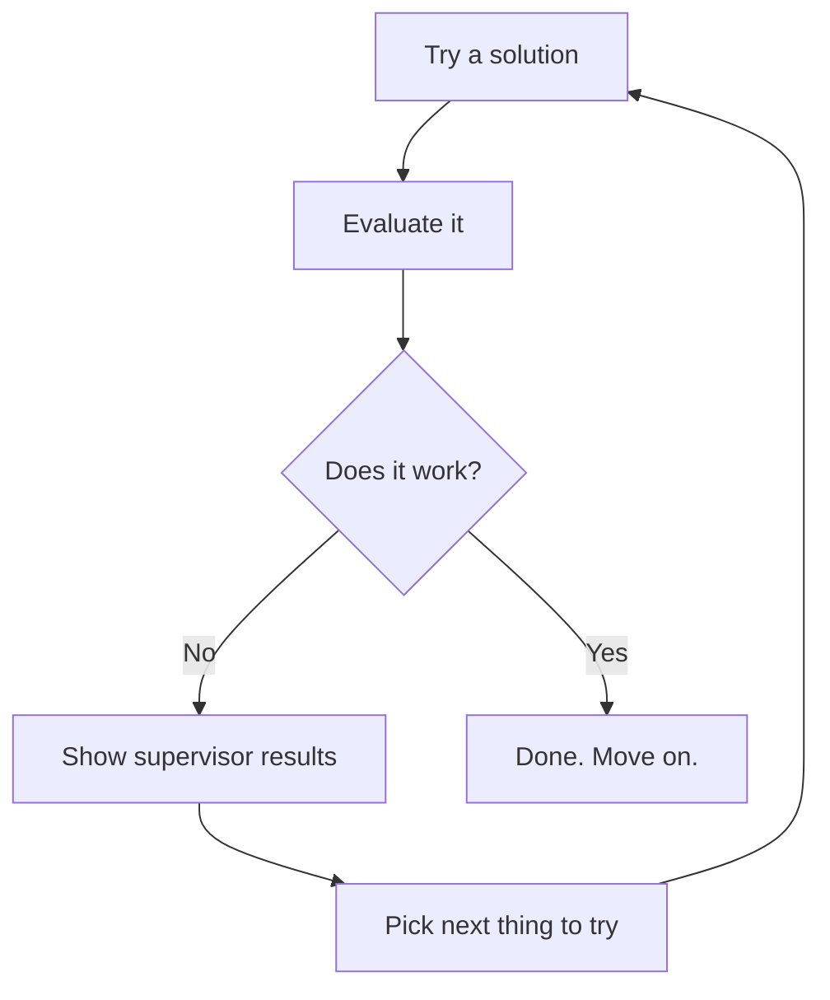
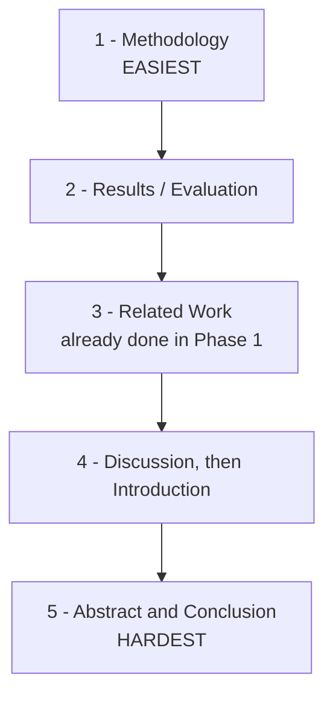
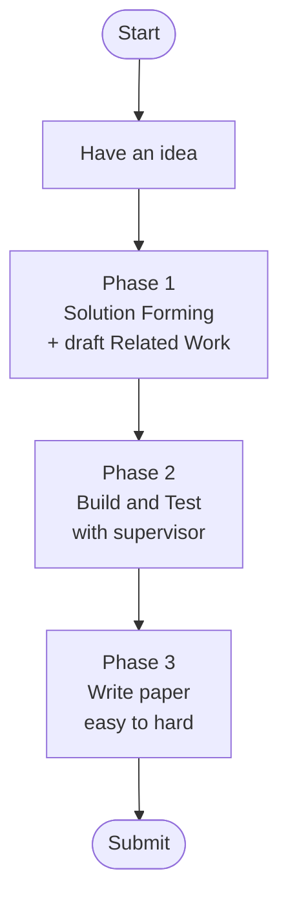

# How to Write a Conference Paper

A guide for first-time paper writers.

---

## The Three Phases

A paper is built in three phases. Do them in order.

---

## Phase 1: Solution Forming

Uses a four-step creative cycle.

### What each step means

| Step | What You Do | What To Expect |
|------|-------------|----------------|
| Preparation | Read papers. Take notes. Sketch the problem. | You will hit a wall. |
| Incubation | Step away. Walk. Rest. | Brain works in background. |
| Illumination | The "aha" moment arrives. | A possible solution appears. |
| Verification | Test the solution. | It may fail. Loop back. |

### Key tip

Write your **Related Work** section during Preparation.

You already have the reading done. Get it out of the way early.

---

## Phase 2: Working on the Solution

Try. Test. Show supervisor. Repeat.

### Rules

- Meet your supervisor on a regular schedule.
- Show every result, even failed ones.
- Propose your next step. Let them adjust it.
- End this phase by making all the graphs you will need.

---

## Phase 3: Writing the Paper

Write sections **easiest first, hardest last**.

### Why this order

| # | Section | Why It Is Easy or Hard |
|---|---------|------------------------|
| 1 | Methodology | You already did the work. Just describe it. |
| 2 | Results / Evaluation | Graphs are already made. Just explain them. |
| 3 | Related Work | Written during Phase 1. |
| 4 | Discussion, then Introduction | Intro is hardest. Save it until the full story is clear. |
| 5 | Abstract and Conclusion | Write together so they match. Short but dense. |

### Note

Some fields merge Discussion into Evaluation. Then write a longer Conclusion instead.

---

## Supervisor Checklist

- [ ] Regular meetings during Phase 2
- [ ] Share results after each attempt
- [ ] Add supervisor to the LaTeX doc while drafting
- [ ] Ask for feedback on each written section

---

## Format Checklist (Before Submitting)

- [ ] Found the conference's template (LaTeX, Word, or Pages)
- [ ] Read past accepted papers from that conference
- [ ] Matched their section structure
- [ ] Stayed within the page limit

---

## Full Project Map

